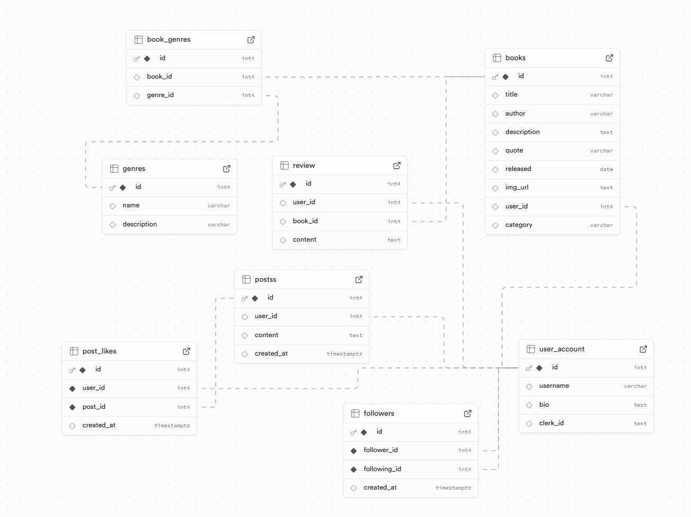

# BookVerse

<p align="center">
  
</p>

<p align="center">
  <strong>Your Gateway to the Book Universe</strong>
</p>

<p align="center">
  Discover, review, and share books with the BookVerse community. Write reviews, create posts, and connect with fellow book lovers.
</p>

<p align="center">
  <a href="https://book-verse-blond.vercel.app">🌐 Live Demo</a>
  •
  <a href="https://github.com/bh-official/BookVerse">🐙 GitHub</a>
  </p>

---

## 📋 Table of Contents

- [Application Overview](#application-overview)
- [Core Features](#core-features)
- [Application Architecture](#application-architecture)
- [The Tech Stack](#the-tech-stack)
- [Database Schema](#database-schema)
- [Schema Visualizer](#schema-visualizer)
- [Security](#security)
- [API Endpoints](#api-endpoints)
- [Page Usability & Flow](#page-usability--flow)
- [Major Changes & Polish](#major-changes--polish)
- [Setup & Execution](#setup--execution)
- [Reflection](#reflection)
- [Requirements Achieved](#requirements-achieved)
- [Challenges](#challenges)
- [What Went Well](#what-went-well)
- [What I Learned](#what-i-learned)
- [Areas for Improvement](#areas-for-improvement)
- [Future Enhancements](#future-enhancements)
- [Summary](#summary)

---

## Application Overview

**BookVerse** is a full-stack web application built with Next.js that serves as a book review community platform. Users can browse books, write reviews, create posts, follow other users, and like posts. The application features a modern dark-themed UI with purple and pink accent colors, providing an immersive reading community experience.

---

## Core Features

### 🔐 Authentication

- **Clerk Integration**: Secure user authentication with sign-in/sign-up modals
- **User Profiles**: Custom profiles with usernames and bios
- **Session Management**: Automatic session handling with redirect support

### 📚 Book Management

- **Browse Books**: View all books in the library with cover images
- **Add Books**: Create new book entries with title, author, description, quotes, release date, and category
- **Edit Books**: Modify book information
- **Categories**: Browse books by genre/category (Fiction, Non-Fiction, Horror, Fantasy, Comedy, etc.)

### ✍️ Reviews & Posts

- **Write Reviews**: Create detailed reviews for any book
- **Edit Reviews**: Modify your reviews
- **Community Posts**: Share thoughts, recommendations, and discussions
- **Edit Posts**: Update your posts
- **Delete Posts**: Remove your posts

### 👥 Social Features

- **Follow System**: Follow/unfollow other users
- **Like Posts**: Like posts from other users
- **User Profiles**: View your profile and other users' profiles
- **Activity Feed**: See posts from users you follow

---

## Application Architecture

```
bookverse/
├── public/                             # Static assets
│   ├── BookVerse.png                   # Logo
├── src/
│   ├── app/                            # Next.js App Router
│   │   ├── api/                        # API routes
│   │   │   └── posts/
│   │   │       └── [id]/
│   │   │           └── like/
│   │   │               └── route.js
│   │   ├── books/
│   │   │   ├── page.js                 # Books listing
│   │   │   ├── new/
│   │   │   │   └── page.js             # Add new book
│   │   │   └── [id]/
│   │   │       ├── page.js             # Book detail
│   │   │       ├── edit/
│   │   │       │   └── page.js         # Edit book
│   │   │       └── review/
│   │   │           └── [reviewId]/
│   │   │               └── edit/
│   │   │                   └── page.js
│   │   ├── categories/
│   │   │   ├── page.js                 # Categories listing
│   │   │   └── [category]/
│   │   │       └── page.js             # Category detail
│   │   ├── posts/
│   │   │   └── page.js                 # Community posts
│   │   ├── sign-in/
│   │   │   └── [[...sign-in]]/
│   │   │       └── page.jsx            # Sign in page
│   │   ├── sign-up/
│   │   │   └── [[...sign-up]]/
│   │   │       └── page.jsx            # Sign up page
│   │   ├── users/
│   │   │   ├── [id]/
│   │   │   │   └── page.js             # Other user profiles
│   │   │   ├── onboarding/
│   │   │   │   └── page.js             # User onboarding
│   │   │   └── you/
│   │   │       ├── page.js             # Current user profile
│   │   │       └── post/
│   │   │           └── [postId]/
│   │   │               └── edit/
│   │   │                   └── page.js
│   │   ├── error.js                    # Error boundary
│   │   ├── globals.css                 # Global styles
│   │   ├── layout.js                   # Root layout
│   │   ├── not-found.js                # 404 page
│   │   └── page.js                     # Landing page
│   ├── components/
│   │   ├── ActionButtons.jsx           # Action button wrapper
│   │   ├── DeleteButton.jsx            # Delete button
│   │   ├── EditButton.jsx              # Edit button
│   │   ├── Footer.jsx                  # Footer component
│   │   ├── Header.jsx                  # Navigation header
│   │   ├── InvalidLink.jsx             # Invalid link component
│   │   ├── LikeButton.jsx              # Like button
│   │   ├── Logo.jsx                    # Logo component
│   │   └── NotFound.jsx                # Not found component
│   └── utils/
│       ├── categories.js               # Category utilities
│       ├── db.js                       # Database connection
│       ├── getUser.js                  # User helpers
├── .gitignore                          # Git ignore
├── .env                                # Environmental variables
├── README.md                           # This file
└── SQL.SQL                             # Database schema
```

---

## The Tech Stack

| Category           | Technology                     |
| ------------------ | ------------------------------ |
| **Framework**      | Next.js 16.1.6 (App Router)    |
| **Language**       | JavaScript/React 19            |
| **Styling**        | Tailwind CSS 4                 |
| **Authentication** | Clerk                          |
| **Database**       | PostgreSQL                     |
| **ORM/Query**      | PostgreSQL node module (pg)    |
| **UI Components**  | Radix UI (AlertDialog, Dialog) |
| **Animations**     | Framer Motion                  |
| **Fonts**          | Google Fonts (Unna, Inter)     |
| **Deployment**     | Vercel                         |

---

## Database Schema

### Tables

1. **user_account** - User profiles
   - `id` (SERIAL PRIMARY KEY)
   - `username` (VARCHAR)
   - `bio` (TEXT)
   - `clerk_id` (TEXT) - Links to Clerk authentication

2. **books** - Book catalog
   - `id` (SERIAL PRIMARY KEY)
   - `user_id` (INT, FK)
   - `title` (VARCHAR)
   - `author` (VARCHAR)
   - `description` (TEXT)
   - `quote` (VARCHAR)
   - `released` (DATE)
   - `img_url` (TEXT)
   - `category` (VARCHAR)

3. **posts** - Community posts
   - `id` (SERIAL PRIMARY KEY)
   - `user_id` (INT, FK)
   - `content` (TEXT)
   - `created_at` (TIMESTAMPTZ)

4. **review** - Book reviews
   - `id` (SERIAL PRIMARY KEY)
   - `user_id` (INT, FK)
   - `book_id` (INT, FK)
   - `content` (TEXT)

5. **followers** - Follow system
   - `id` (SERIAL PRIMARY KEY)
   - `follower_id` (INT)
   - `following_id` (INT)
   - `created_at` (TIMESTAMPTZ)
   - UNIQUE constraint on (follower_id, following_id)

6. **post_likes** - Post likes
   - `id` (SERIAL PRIMARY KEY)
   - `user_id` (INT)
   - `post_id` (INT)
   - `created_at` (TIMESTAMPTZ)
   - UNIQUE constraint on (user_id, post_id)

7. **genres** - Book genres
8. **book_genres** - Book-genre associations

---

## Schema Visualizer

```


```

---

## Security

- **Authentication**: Clerk handles all authentication securely
- **Database Connections**: Parameterized queries prevent SQL injection
- **Environment Variables**: Sensitive data stored in `.env`
- **Error Handling**: Global error boundaries protect application stability
- **Route Protection**: Server components validate user sessions
- **Input Validation**: Form inputs validated on both client and server

---

## API Endpoints

BookVerse uses Next.js App Router with Server Actions and form submissions. Here's a comprehensive list of all data operations:

### Server Actions & Form Functions

| Action           | File                                                | Function               |
| ---------------- | --------------------------------------------------- | ---------------------- |
| Like/Unlike Post | `src/app/api/posts/[id]/like/route.js`              | `POST` handler         |
| Create Book      | `src/app/books/new/page.js`                         | Form action            |
| Update Book      | `src/app/books/[id]/edit/page.js`                   | Form action            |
| Delete Book      | `src/app/books/[id]/page.js`                        | DeleteButton component |
| Create Review    | `src/app/books/[id]/page.js`                        | Form action            |
| Update Review    | `src/app/books/[id]/review/[reviewId]/edit/page.js` | Form action            |
| Create Post      | `src/app/users/you/page.js`                         | Form action            |
| Update Post      | `src/app/users/you/post/[postId]/edit/page.js`      | Form action            |
| Delete Post      | `src/app/users/you/page.js`                         | DeleteButton component |
| Update Profile   | `src/app/users/onboarding/page.js`                  | Form action            |
| Follow User      | `src/app/users/[id]/page.js`                        | Server action          |
| Unfollow User    | `src/app/users/[id]/page.js`                        | Server action          |

---

### Data Access Patterns

Since BookVerse uses Next.js App Router, most data operations are performed directly in Server Components:

#### Server Actions (Form Submissions)

The application uses form actions for:

- Creating new books (`/books/new/page.js`)
- Adding reviews (`/books/[id]/page.js`)
- Creating posts (`/users/you/page.js`)
- Updating profiles (`/users/onboarding/page.js`)
- Editing reviews (`/books/[id]/review/[reviewId]/edit/page.js`)

---

### Error Responses

All API routes return consistent error responses:

| Status Code | Description                            |
| ----------- | -------------------------------------- |
| 400         | Bad Request - Invalid parameters       |
| 401         | Unauthorized - Not logged in           |
| 404         | Not Found - Resource doesn't exist     |
| 500         | Internal Server Error - Server failure |

---

## Page Usability & Flow

### Landing Page (`/`)

- Hero section with animated text
- Feature highlights
- Call-to-action buttons
- Animated book showcase

### Books (`/books`)

- Grid display of all books
- Book cover images
- Author and title
- Category tags
- Add book button (authenticated)

### Book Detail (`/books/[id]`)

- Full book information
- Reviews section
- Add review functionality
- Edit/Delete book (owner only)

### Categories (`/categories`)

- Browse by category
- Book count per category
- Category emojis

### Posts (`/posts`)

- Community posts feed
- Like functionality
- User attribution

### User Profile (`/users/you`)

- Your posts
- Edit profile
- Follower/following counts
- Add post functionality

### Other Profiles (`/users/[id]`)

- View other users
- Follow/unfollow
- Their posts

### Authentication

- Sign In modal
- Sign Up modal
- Profile setup (onboarding)

---

## Major Changes & Polish

1. **Font Improvements**
   - Added Inter font for body text
   - Added Unna serif font for headings
   - Better typography hierarchy

2. **Styling Consistency**
   - Unified dark theme across all pages
   - Purple/pink accent colors
   - Custom scrollbars

3. **Menu Styling**
   - Styled Clerk sign-in/sign-up modals
   - User dropdown menu styling
   - Consistent button styles

4. **Error Handling**
   - Global error boundary
   - Custom 404 pages
   - Invalid route handling
   - Profile not found pages

5. **Component Refinement**
   - Reusable EditButton component
   - Reusable DeleteButton component
   - Consistent action buttons across app

---

## Setup & Execution

### Prerequisites

- Node.js 18+
- npm
- PostgreSQL database
- Clerk account

### Installation

```bash
# Clone the repository
git clone https://github.com/bh-official/BookVerse.git
cd bookverse

# Install dependencies
npm install

# Set up environment variables
# Create .env file with:
# DATABASE_URL=your_postgres_connection_string
# NEXT_PUBLIC_CLERK_PUBLISHABLE_KEY=your_clerk_key
# CLERK_SECRET_KEY=your_clerk_secret

# Run the development server
npm run dev

# Open http://localhost:3000
```

### Build for Production

```bash
npm run build
npm start
```

---

## Reflection

### Requirements

| #   | Requirement                                                                              | Status       |
| --- | ---------------------------------------------------------------------------------------- | ------------ |
| 1   | Set up user sign-up and user login using Clerk                                           | ✅ Completed |
| 2   | Create and display an error/not found page if the user visits a page that doesn't exist  | ✅ Completed |
| 3   | Use 1 or more Radix UI Primitive component (e.g., AlertDialog)                           | ✅ Completed |
| 4   | Enable users to create a user profile with biography using a form, stored in database    | ✅ Completed |
| 5   | Enable users to create posts associated with their Clerk userId                          | ✅ Completed |
| 6   | Display posts on the user's profile page                                                 | ✅ Completed |
| 7   | Allow users to update their content via dynamic route (/users/you/post/[postId]/edit)    | ✅ Completed |
| 8   | Allow users to delete their content                                                      | ✅ Completed |
| 9   | Allow users to view other profiles directly from posts using dynamic route (/users/[id]) | ✅ Completed |
| 10  | Let users follow each other (follower/followee relationship)                             | ✅ Completed |
| 11  | Enable users to like posts (user_id linked to liked_post in junction table)              | ✅ Completed |
| 12  | Ensure user's biography cannot be left blank - prompt if missing                         | ✅ Completed |
| 13  | Create and display error page if user visits non-existent profile                        | ✅ Completed |

### Requirements Achieved

✅ User authentication with Clerk  
✅ Book catalog with CRUD operations  
✅ Book reviews system  
✅ Community posts  
✅ Follow/unfollow system  
✅ Like posts functionality  
✅ User profiles with bios  
✅ Category browsing  
✅ Error handling pages  
✅ Responsive design  
✅ Dark theme UI

### Challenges

#### 1. Integrating Clerk Authentication with Custom Database

**Challenge:** Clerk handles authentication externally, but we needed to link Clerk users to our local PostgreSQL database to store profiles, posts, and social connections.

**Solution:**

- Created a `user_account` table with a `clerk_id` field to link Clerk users
- Built a `getUser()` utility function that maps Clerk's `userId` to local database user
- Implemented an onboarding flow that creates a database record when users first sign up
- Used Clerk's `useUser()` hook to get the authenticated user and query our database

---

#### 2. Handling Dynamic Routes with Next.js App Router

**Challenge:** Next.js 16 App Router handles dynamic routes differently than the Pages Router. Parameters like `[id]` need to be handled as promises.

**Solution:**

- Learned to use `await params` to access dynamic route parameters in Next.js 16
- Created separate pages for different ID types (users, books, posts)
- Implemented proper validation for route parameters to prevent 404 errors
- Used Server Components to fetch data directly in the route handler

---

#### 3. Managing Complex State for Likes and Follows

**Challenge:** Social features require real-time state management between client and server. The like button needed to toggle and update the count without a page reload.

**Solution:**

- Created a client-side `LikeButton` component that calls a Server API route
- Used the `/api/posts/[id]/like` endpoint to handle the toggle logic
- Implemented optimistic UI updates for immediate feedback
- Added proper error handling for unauthorized users

---

#### 4. Database Schema Design for Social Features

**Challenge:** Designing a schema that supports followers, following, and post likes efficiently without data duplication.

**Solution:**

- Created a `followers` table with `follower_id` and `following_id` with a UNIQUE constraint to prevent duplicate follows
- Created a `post_likes` junction table linking users to posts with the same UNIQUE constraint
- Used proper foreign key relationships to maintain data integrity
- Added indexes on frequently queried columns for performance

---

#### 5. Styling Consistency Across Components

**Challenge:** Maintaining consistent purple/pink dark theme across many different components and pages.

**Solution:**

- Created centralized color variables in `globals.css`
- Built reusable components (EditButton, DeleteButton, LikeButton) with consistent styling
- Applied uniform Tailwind classes for buttons, cards, and typography
- Styled Clerk components with custom appearance settings
- Used Framer Motion for consistent animations

---

#### 6. Ensuring Bio is Not Blank

**Challenge:** Required users to have a biography but needed to handle both new users and existing users without bios.

**Solution:**

- Created an onboarding page that forces bio input before accessing the full app
- Added validation in the onboarding form to prevent empty bios
- Added a check on profile access to redirect users without bios to complete their profile
- Made the bio field required in the database (NOT NULL where appropriate)

---

#### 7. Error Handling for Non-Existent Profiles

**Challenge:** Users might try to access profiles that don't exist via the `/users/[id]` route.

**Solution:**

- Added database queries to check if a user exists before rendering the profile
- Created a reusable `InvalidLink` component for consistent error messaging
- Implemented proper 404 handling with user-friendly messages
- Added validation to check if the user ID is valid before querying

### What Went Well

- Clean component architecture
- Reusable UI components
- Consistent dark theme
- Smooth animations with Framer Motion
- Good separation of concerns

### What I Learned

- Next.js 16 App Router patterns
- Clerk authentication integration
- PostgreSQL with Node.js
- Radix UI for accessible components
- Framer Motion animations
- Tailwind CSS customization

### Areas for Improvement

- Add more test coverage
- Implement caching strategies
- Add loading skeletons
- Improve mobile responsiveness
- Add search functionality
- Add notifications system

### Future Enhancements

- Book recommendations algorithm
- Reading lists/shelves
- Comments on posts
- Direct messaging
- Book ratings (1-5 stars)
- User activity feed
- Social sharing
- Reading progress tracking

---

## Summary

BookVerse is a comprehensive book review community platform that demonstrates full-stack web development with modern technologies. It provides a clean, dark-themed interface for book lovers to discover literature, share reviews, and connect with fellow readers. The application showcases proper authentication integration, database design, and responsive UI development.

---

<p align="center">
  Made with ❤️ for book lovers everywhere
</p>
